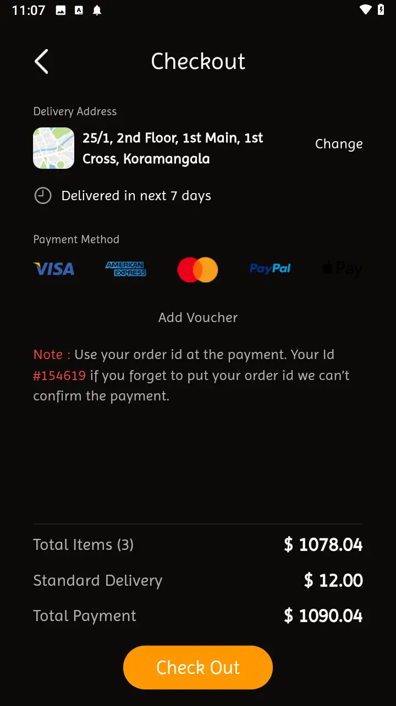
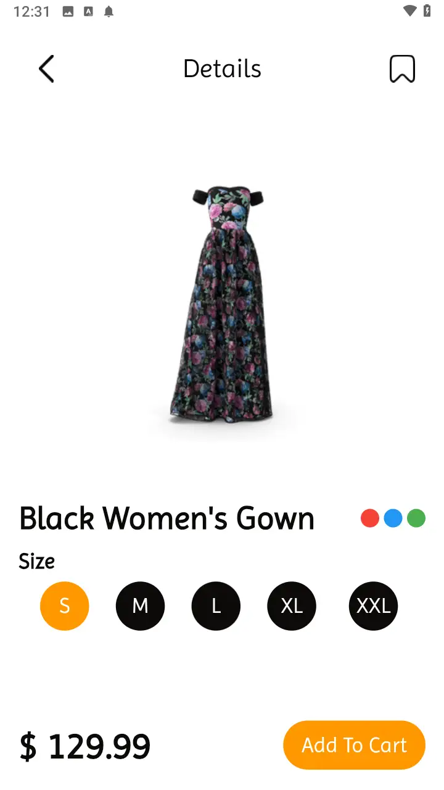
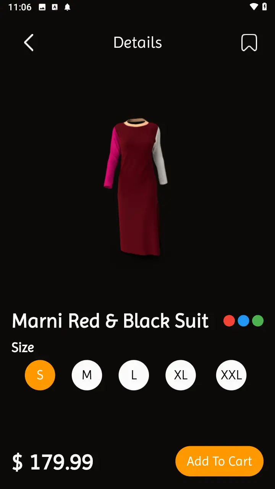
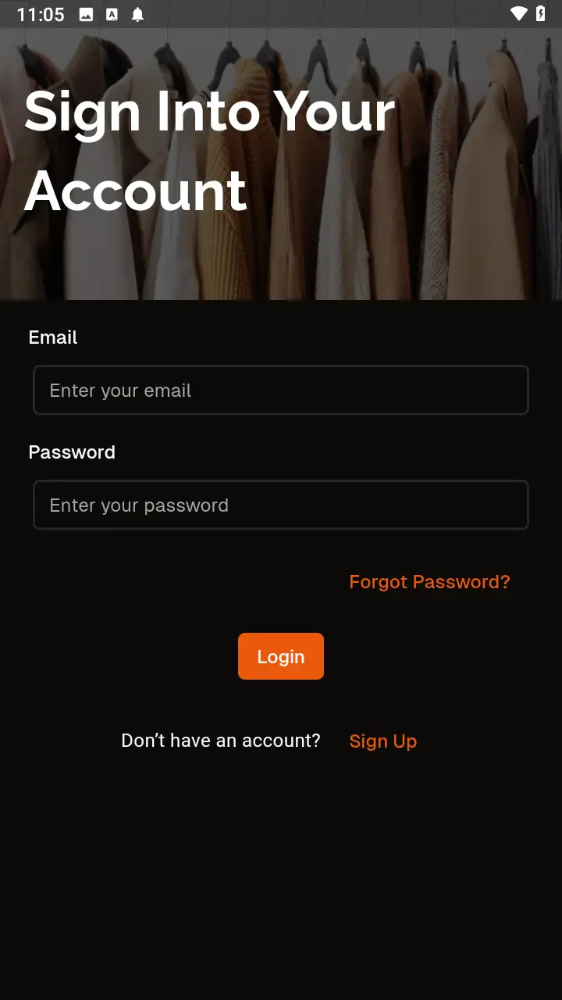
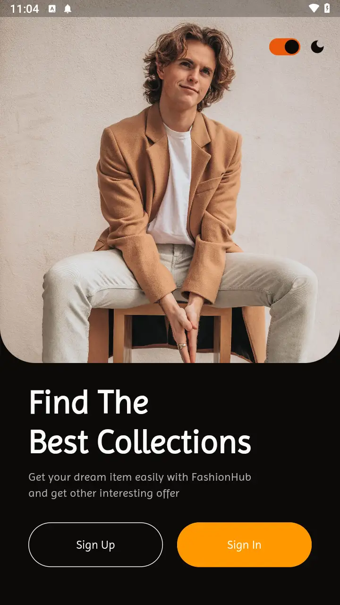
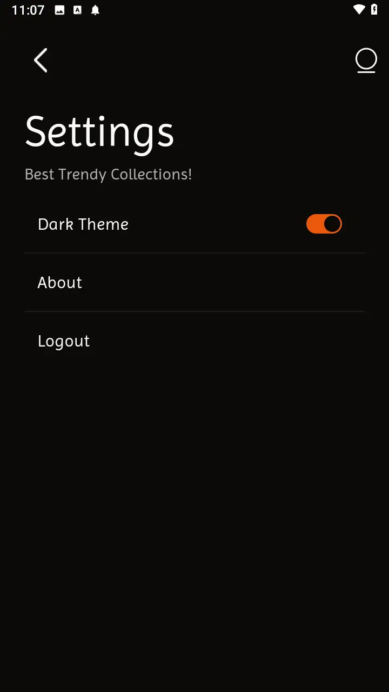

# Fashion Hub

**Fashion Hub** is a sleek brand store application built with Flutter. It offers features like
authentication, a cart system, light and dark themes, and a search functionality for a seamless
shopping experience. With a modern UI inspired by [shadcn_ui](https://pub.dev/packages/shadcn_ui),
the app ensures a user-friendly interface.

Live preview [Click to view](https://thefashionhub.web.app/)

---

## Features

- **Authentication**:
    - Login, Sign-Up, and Reset Password screens.
    - Firebase Authentication for secure user management.

- **Cart System**:
    - Add items to the cart.
    - Delete items from the cart using the `slidable` package.

- **Light and Dark Themes**:
    - Easily toggle between themes for a customized user experience.

- **Search Functionality**:
    - Search items within a category by name.
    - Realtime updates with local data.

- **Hero Animations**:
    - Smooth transitions for a polished UI.

- **State Management**:
    - Managed efficiently with the `riverpod` package.

- **Loading Shimmer Effects**:
    - Visual enhancements for loading states.

---

## Screenshots

Below are paired screenshots for light and dark themes, arranged side by side. Each row contains
four screenshots.

|            |          |        |      |
|-------------------------------------------------------------|---------------------------------------------------------|-----------------------------------------------------------------|-------------------------------------------------------------|
|      |    |        |        |
|        |        |  |  |
|        |        |          |          |
|  |  |          |        |

## Screen Recordings

Screen recordings are available in the `assets/screenrecords` folder for a visual demonstration of
the features:

1. **Authentication Screens**:
    - [`Auth Screens.mov`](assets/screenrecords/Auth%20Screens.mov): Demonstrates Login, Sign Up,
      Reset Password, and logging into an existing account.
    - https://github.com/Zaptek-Flutter/brand_store_app/blob/main/assets/screenrecords/Auth%20Screens.mov

2. **Explore Tab (Light Theme)**:
    - [`Explore_Light_Theme.mov`](assets/screenrecords/Explore%20Light%20Theme.mov): Browse items
      and
      add a selected
      item to the cart.

3. **Cart and Deletion (Light Theme)**:
    - [`Cart_And_Deletion_Light_Theme.mov`](assets/screenrecords/Cart%20And%20Deletion%20Light%20Theme.mov):
      View items in the cart and delete them.

4. **Search Functionality (Light Theme)**:
    - [`Search_Light_Theme.mov`](assets/screenrecords/Search Light Theme.mov): Walkthrough of
      the
      search functionality, including category-based search.

5. **Checkout Process**:
    - [`Checkout.mov`](assets/screenrecords/Checkout.mov): Demonstrates the checkout flow.

6. **Light and Dark Themes**:
    - [`Light_And_Dark_Theme.mp4`](assets/screenrecords/Light%20And%20Dark%20Theme.mov): Toggles
      between
      light and dark themes and logs out.

---

